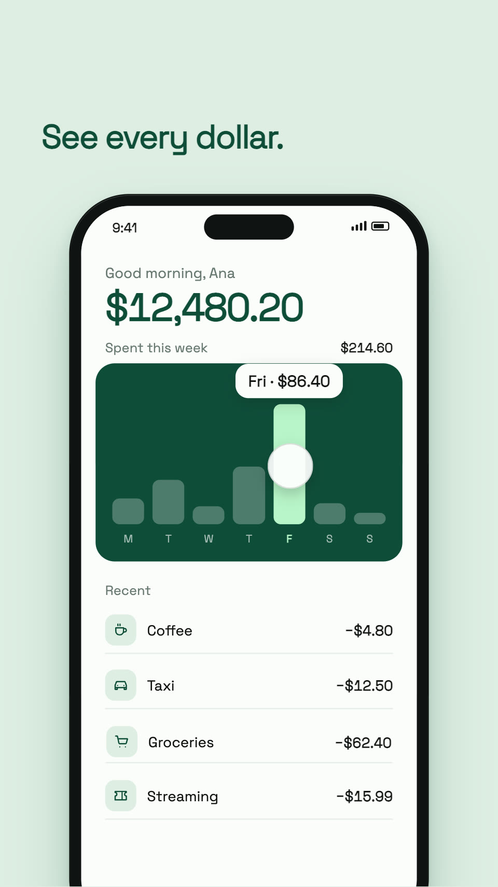

# App promo

A 15-second 9:16 app ad for "Kept", a made-up money app, told as one
movement: the money is the thread. Loose receipts land in the phone as its
rows, the week grows from them, the groceries row opens into what is left,
what is left flows into a goal, and the goal becomes the app's icon. Nothing
cuts and nothing slides. 1080×1920 at 60 fps, with its own music.

## The beats

Each beat becomes the next (`BEATS` in `src/timing.ts`):

| At | Beat | What it is | How it becomes the next |
|---|---|---|---|
| 0s | The question | "Where did your money go?" lands on three beats among loose receipts | the question rises away as the phone rises under it |
| 2s | Into order | each receipt flies into the phone and lands as its row in Recent | the week's chart grows above the rows they make |
| 3s | Every dollar | the week as a chart; a tap opens Friday | the same finger goes on to the groceries row |
| 6s | What's left | the groceries row opens in place into its budget: a ring of what is spent, and what is left in mint | the mint flows round the ring and out of it as "+$118" |
| 9s | Kept | the screen follows the money down; it lands in the trip and fills it | the goal card lifts out of the phone as the phone leaves |
| 12s | The mark | the card becomes the icon; the name, one line, where to get it | it holds |

## What to change

- **Everything it says**: `src/content.ts`: the app's name and line, the
  colours, the hook, the receipts, the captions, the week, the budgets and
  the goals. Keep the numbers consistent: the week adds up, the ring shows
  what is left, and what is left is what goes into the goal.
- **The moments**: `src/timing.ts`, on one grid: 120 BPM at 60 fps, a beat
  is 30 frames, a bar 120; the beats turn on bars.
- **The app**: `src/screens/Home.tsx` is the app's one screen, drawn on the
  phone (`src/elements/phone`): the balance, the week, the rows, the opened
  budget and the goals below, in one page that scrolls. Replace it with your
  app's own screen, at the same size, and keep what is tapped in the upper
  part.
- **The sound**: `SOUNDS` in `src/Video.tsx`, each on the frame its cause
  happens (a tap, the row opening, the money landing). The music is made by
  `tools/score.mjs` from nothing (no samples): change it, run
  `node tools/score.mjs`, then
  `veymelo ffmpeg -- -y -i assets/score.wav -c:a aac -b:a 192k assets/score.m4a`.
- **Other sizes**: it is drawn at 1080×1920 and scaled to cover any frame;
  for a wide or square cut, move the phone and the captions in
  `src/stage.ts` and `src/scenes/Captions.tsx`.

## What to keep

- One thread: the money. The receipts of the hook are the rows of the app,
  the row is the budget, what is left of it is the "+$118" that goes into
  the goal, and the goal is the mark.
- Hand-offs, not screens: a row opens in place, the page scrolls after the
  money; nothing slides in from the side and nothing cuts.
- The camera stays at rest; the app moves. One tap per beat, and the screen
  answers on the frame of the tap.
- Mint means money kept, and nothing else.
- The phone large, running off the bottom edge; words and taps clear of the
  apps' own buttons and captions (top 12%, bottom 22%, right 14%).
- The end holds: the most resolved moment, not the loudest.
