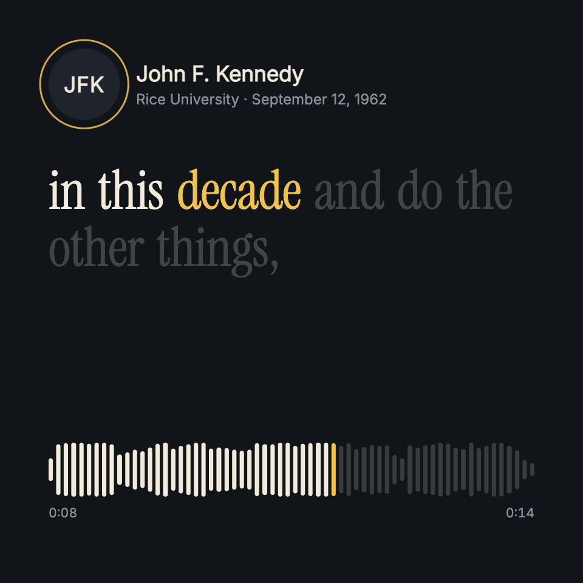

# Audiogram

A clip of someone speaking, made to be watched with the sound off as much as
on. The real sound drives everything: each word lights as it is said, the
timeline is the clip's own loudness, and the ring around the speaker breathes
with their voice. Square by default (1080×1080, 60 fps); tall and wide lay
out their own way. The render includes the captions as SRT and VTT.

## The clip in this example

John F. Kennedy at Rice University, 12 September 1962 ("We choose to go to
the Moon"), from the John F. Kennedy Presidential Library via
[Wikimedia Commons](https://commons.wikimedia.org/wiki/File:Jfk_rice_university_we_choose_to_go_to_the_moon.ogg).
It is in the public domain in the United States as a work of the federal
government. It is cut to 14 seconds, with the applause between the lines
shortened.

## Use your own clip

1. Put the clip at `assets/clip.m4a` (any length; 15 to 60 seconds suits
   social feeds).
2. Run `node tools/prepare.mjs`. It measures the clip's loudness on every
   frame (`src/levels.json`) and sets the video's length to the clip plus the
   end card (`--end 2.6` seconds).
3. In `src/content.ts`, write who is speaking, the end card, and the words:
   one phrase per cue, every word with the second it is said in the clip.
   Listen, or use any transcription tool with word timings, then check each
   phrase against the clip; mark long pauses and applause as a cue with a
   `note`.
4. For another shape, set the size in `veymelo.config.json` or render several:
   `veymelo render --size 1080x1080,1080x1920,1920x1080`.

## What to change

- **The look**: `COLOR` in `src/content.ts` (the ground, the words, the accent
  for the word being said) and the fonts in `src/fonts.ts`.
- **A photo**: put a square photo in `assets/` and set `SPEAKER.photo`.
- **Where things go**: `src/layout.ts`, one layout for each shape of frame.

## What to keep

- One phrase on screen at a time, two or three lines at most, each word lit on
  the frame it is said.
- The timeline is the real sound, not a decoration.
- The first frame is the cover: the speaker, the first phrase and the clip are
  already there.
- Tall frames keep words clear of the apps' own buttons and captions (top 12%,
  bottom 22%).
