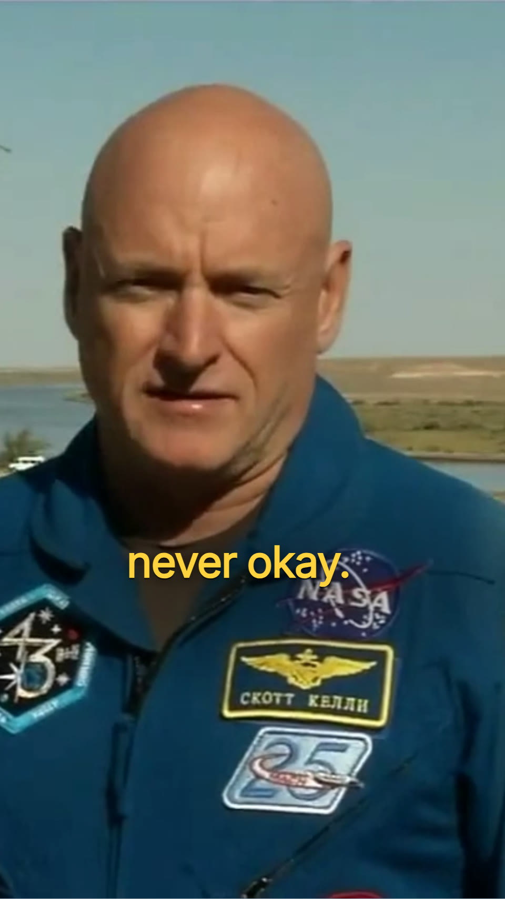

# Caption reel

A talking clip made into a 9:16 reel: cut on the words (pauses and asides
out, a punch-in on new sentences), big captions a few words at a time with
the word being said lit, a hook over the first seconds, and an end card.
1080×1920 at 30 fps; the render includes the captions as SRT and VTT.

## The clip in this example

Astronaut Scott Kelly's message against bullying, made by NASA for the
Federal Partners in Bullying Prevention campaign (NASA Johnson, via
[Wikimedia Commons](https://commons.wikimedia.org/wiki/File:Astronaut_Scott_Kelly_Speaks_Out_Against_Bullying.webm)).
It is in the public domain in the United States as a work made solely by
NASA. The NASA intro is left out (NASA's insignia may not be used to suggest
endorsement), and the reel adds no account name or claim of its own. The
source is 720p, so the tall crop is a little soft; a 1080p clip is sharper.

## Use your own clip

1. Import it: `veymelo import <file> --name clip` (it becomes
   `assets/clip.mp4`, ready to cut on any frame).
2. Get its words with their times, for example with whisper.cpp:
   `veymelo ffmpeg -- -i assets/clip.mp4 -ar 16000 -ac 1 clip16.wav`,
   `whisper-cli -m <model> -f clip16.wav -ml 1 -sow -ojf -of words`, then
   `node tools/words.mjs words.json` prints the lines for `WORDS` in
   `src/content.ts`. Check names and numbers, and check each cut against
   the sound: a cut belongs in a pause, never inside a word.
3. In `src/content.ts`, list the `SHOTS` to keep (seconds of the clip, each
   with its zoom), the `EMPHASIS` words, the `HOOK`, the `END` card and
   `FOCUS` (where the face is, so the tall frame is cut around it).
4. Set `durationInFrames` in `veymelo.config.json` to the shots plus the end
   card (the length `src/edit.ts` works out as `TOTAL_FRAMES`).

## What to change

- **The look**: `COLOR` in `src/content.ts`; the caption style in
  `src/elements/Captions.tsx`; the font in `src/fonts.ts`.
- **The chunks**: `src/edit.ts` groups up to four words and 16 letters, and
  starts a new chunk after punctuation, a pause or a cut.

## What to keep

- Open on the story, not a greeting; the first frame (the cover) already says
  what this is.
- Cuts in the pauses; a punch-in on a new sentence keeps a long take alive.
- Captions a few words at a time, the word being said lit, the words that
  carry the point landing in the accent.
- Words and faces clear of the apps' own buttons and captions (top 12%,
  bottom 22%, right 14%).
