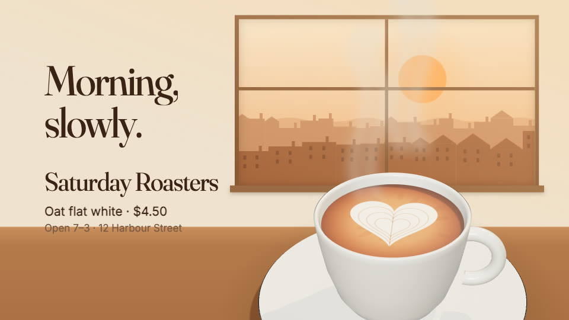

# Coffee morning

A 12-second café ad. Dawn comes up over the town; the camera pulls back
through the café's window to the counter, where a cup sits in the low sun;
a steel jug pours the milk into a heart; then the café's name, the drink and
where to find it. 1920×1080 at 60 fps, with a tall cut (1080×1920) built in
and its own music. "Saturday Roasters" is made up.

| Time | What happens |
|---|---|
| 0–2.5s | The town at dawn, in layers: the sun rises, windows go dark one by one, two birds cross |
| 2.5–4s | The pull-back: the town becomes the view from the café's window; the counter and the cup rise into the frame |
| 4–7.5s | The pour: a round of foam grows in rings, then the pour pulls through it into a heart |
| 7.5–12s | Steam rises into the sun in the window; the café's name, the drink and the hours |

The cup, the saucer and the jug are three.js (ceramic and brushed steel, lit
by the sun from behind); run `npm install` before the first render.

## What to change

- **Everything it says, and its colours**: `src/content.ts` (the café, the
  drink, the hours, the two-beat line, the palette).
- **The moments**: `src/timing.ts`, on the music's grid (80 BPM, a bar is 3
  seconds).
- **The latte art**: `src/art.ts` draws the coffee's surface (crema, then the
  milk) on a canvas the cup wears; the heart is a circle that morphs, so a
  tulip or a rosetta is a different outline there.
- **The cup and the jug**: `src/scenes/Coffee3D.tsx`: their shapes are
  lathe profiles (a list of radius and height pairs), the lights are the sun
  through the window and a soft fill.
- **The town and the café**: `src/scenes/Dawn.tsx` (the layers, the windows,
  the birds) and `src/scenes/Cafe.tsx` (the wall, the window, the counter).
- **The shape of the frame**: `src/layout.ts`, one layout for wide and one
  for tall.
- **The sound**: `tools/sound.mjs` makes the music, the birds and the pour
  from nothing (no samples); run `node tools/sound.mjs`, then
  `veymelo ffmpeg -- -y -i assets/score.wav -c:a aac -b:a 192k assets/score.m4a`.
  The effects play on the frame their cause happens (`SOUNDS` in
  `src/Video.tsx`).

## What to keep

- One continuous move from the town to the cup: the dawn is the view from
  the window, never a cut away.
- The coffee is the hero: large, in the warm light from behind, the steam lit
  by the sun.
- One thing happens at a time: the sun, then the pull-back, then the pour,
  then the name. The end holds.
