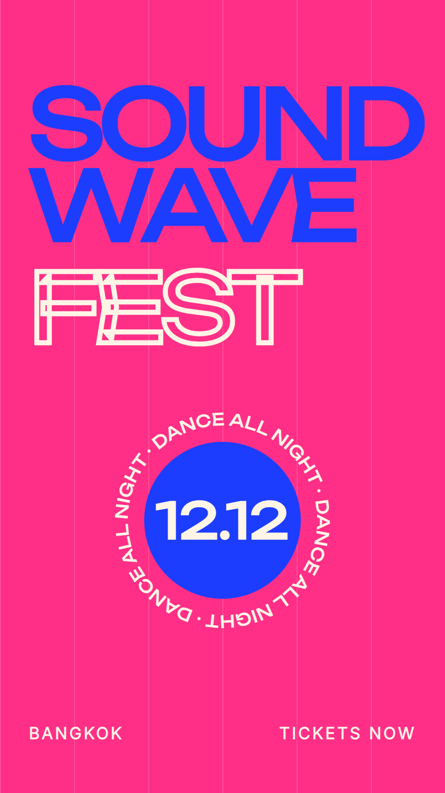

# Countdown poster

A 9:16 festival poster: a countdown, then the name lands with a spinning date badge.

1080×1920 at 60 fps, 4 seconds. One scene, ready to grow into a
longer video. It began as one of the results in the [launch reel](../launch-reel).

## What to change

- **The picture**: `src/elements/poster/index.tsx`. Its colours are constants at
  the top, its words, numbers and shapes are in the JSX, and its timing is in
  frames (60 a second) with `k()` (0 to 1 between two frames) and `sp()` (a
  spring) from `src/kit.ts`.
- **The length**: `durationInFrames` in `veymelo.config.json`; add screens in
  `src/Video.tsx`. It is drawn at its design size (1080×1920) and scaled
  to cover any frame you render.
- **The sound**: `SOUNDS` in `src/Video.tsx`: beep, hit (in `assets/sfx`), each on the frame its cause happens.
- **The type**: `src/fonts.ts`: Inter, Unbounded (open-licensed, in `assets/fonts`).

## What to keep

Each count on a beat; the name lands on the last hit.
