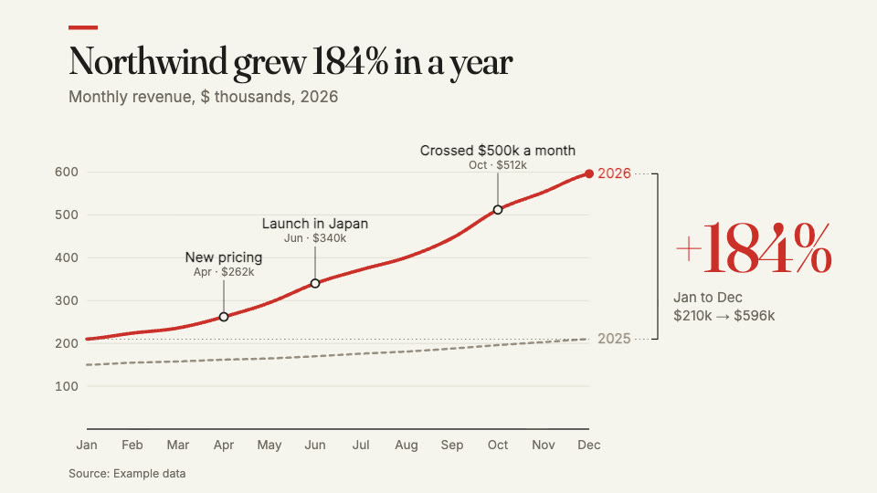

# Growth chart

A year of growth as a printed chart, in 15 seconds. The headline states the
finding (it is on the cover), the line draws month by month with a short note
where something happened, last year comes in for comparison, and a bracket
marks the change. A quiet tone follows the line as it draws. 1920×1080 at
60 fps, with a tall cut (1080×1920) built in. "Northwind" and its numbers
are example data.

## Use your own numbers

Everything it says comes from `src/data.json`:

- `headline`: the finding, in a sentence (the cover);
- `subtitle`: what is measured, in what unit, when;
- `months`, `values`: the series; `lastYear`: the comparison (the same
  length);
- `milestones`: `{month, label}` notes on the line, at the months they
  happened;
- `unit`, `scale`, `year`, `source`.

The growth, the axis, every label and the tone are worked out from the data,
so they always agree with it. After changing the data, run
`node tools/sound.mjs` and
`veymelo ffmpeg -- -y -i assets/score.wav -c:a aac -b:a 192k assets/score.m4a`
so the tone follows the new line.

## What to change

- **The look**: `COLOR` in `src/content.ts` (the paper, the ink, the one
  accent); the fonts in `src/fonts.ts`.
- **The moments**: `src/timing.json` (the gridlines, the line, last year, the
  change), read by the picture and by the sound.
- **Where things sit**: `frame()` in `src/chart.ts`, one layout for wide and
  one for tall.

## What to keep

- A headline that says the finding, not the topic.
- One accent: this year's line and the change; everything else is ink and
  grey.
- Notes on the line, not in boxes or a legend; the source at the foot.
- The camera still: only the line moves.
