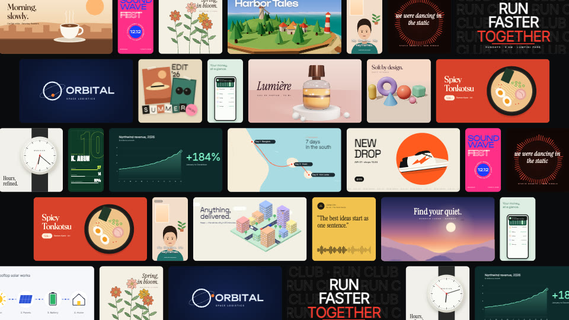

# Launch reel

A 90-second launch film for a tool or an app: the command typed, the app at
work, prompt after prompt turning into a result, a wall of everything it
makes, the code behind it, and the end card. 1920×1080 at 60 fps, with a
tall cut (1080×1920) built in. It was made for Veymelo's own launch.

## What it is for

Showing what a product makes, many times over, quickly: a developer tool, an
AI app, a template library, a creative service. It works best when the
product turns a short input into a visible result.

## What to change

- **The screens and their lengths**: `src/timing.ts` (`SCENES`). One timing
  grid for picture and sound: 120 BPM at 60 fps, a beat is 30 frames
  (`b(bar, beat)`).
- **The brand**: colours and fonts in `src/theme.ts`; the name in
  `src/elements/endcard`, `viewer`, `terminal` and `src/scenes/How.tsx`; the
  command in `src/elements/terminal` and `endcard`.
- **What the product makes**: `src/elements/results/`. Each result is one
  small video (`r01-sneaker.tsx` … `r22-botanical.tsx`), listed in
  `registry.ts` with its shape (16:9, 9:16 or 1:1), the prompt typed for it
  and its sounds. Replace them with your product's own results; keep a few
  that show range. `tools/peek.sh <id>` looks at one result alone.
- **The app on screen**: `src/elements/viewer` (the app window), `chat` (the
  AI talking), `terminal`, `code`.
- **The sound**: `tools/score.mjs` synthesizes the score and every effect
  from nothing (no samples). Change it, run `node tools/score.mjs`, then
  convert the score: `veymelo ffmpeg -- -y -i assets/score.wav -c:a aac -b:a 256k assets/score.m4a`.
  Effects play on the frame their cause happens (the `*Sounds` lists in
  `src/scenes/`).

## What to keep

- One thing travels through every screen: the yellow `>` prompt caret. Each
  result opens from it, and at the end it turns into the logo's V. Give your
  product its own travelling thing.
- The motion system in `src/motion.ts`: `enter`, `exit`, `move`, and the
  `settle` and `snap` springs. Words never bounce; one small overshoot is
  for results landing.
- Picture and sound on one grid (`src/timing.ts`): cuts and arrivals on the
  beat.

The fonts are open-licensed (Google Fonts). The score and effects are made by
`tools/score.mjs`.
