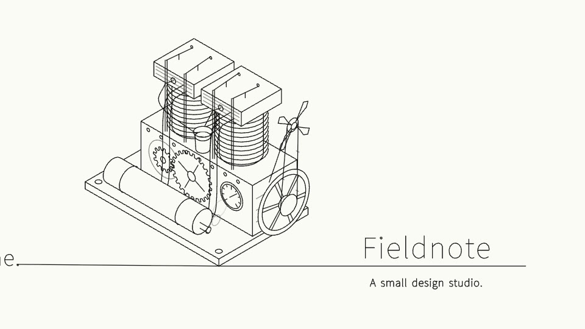

# One pen

A 16.5-second piece drawn by one pen, the way veymelo.com is drawn: a single
hairline writes the words in single-stroke letters, pulls the full stop out
into a line, and on that line draws one machine, a two-cylinder engine, in
every detail. Then the engine starts and runs, and the line goes on to the
name. Black ink on white, 1920×1080 at 60 fps, and any other shape of frame
(a tall frame puts the name under the engine). "Fieldnote" is made up.

## The beats

It is all one line: the pen never lifts, and each beat is drawn out of the
one before (`BEATS` in `src/timing.ts`).

| At | Beat | What it is | How it becomes the next |
|---|---|---|---|
| 0.2s | Every idea starts as a line | the pen comes in and writes, letter by letter | the full stop does not end: it is pulled out |
| 2.2s | The line | the line runs across the page, the camera with it | it becomes the ground the machine stands on |
| 2.9s | The machine | the engine, part by part: skid, block, finned cylinders, heads, rockers and push rods, plugs and leads, gears, gauge, exhaust and silencer, flywheel, belt and fan | the last line drawn, it catches |
| 9s | It runs | the flywheel, the gears (two to one), the fan and the belt turn; rockers rock, push rods lift, the needle rises, smoke puffs, the whole thing shakes a little | the line runs on |
| 9.8s | The name | the name is written on the line, the line under it; the camera draws back to take it in | it holds, the engine still running |

## What to change

- **The words**: `src/content.ts` (`WORDS`): the two lines, the name and the
  line under it, and the theme (`'light'` ink on paper, or `'dark'`). The
  pen writes Latin text only (`src/pen/glyphs.ts`); other scripts need a
  typeface instead.
- **The machine**: `src/engine.ts`. It is one function of how the engine is
  running (`angle`, `power`): every part is a few lines of isometric
  drawing from `src/pen/iso.ts` (`box`, `drum`, `ring`, circles standing up,
  gears, tubes), listed in the order the pen draws them. Draw something else
  the same way: a camera, a bicycle, a building; anything that moves is a
  function of the angle.
- **The pen**: `src/pen/route.ts` plans its whole route from the pieces in
  `src/story.ts` (their strokes, how fast it draws each, how fast it hops
  between strokes) and works out every frame from that alone: where its head
  is, how far each stroke is drawn, when it is drawing (for the nib's sound).
- **The camera**: the shots and when it moves between them, in `story()`
  and `cameraAt()` in `src/story.ts`; it only ever moves on.
- **The sound**: `tools/sound.mjs` makes the music, the nib on the paper,
  the engine and the notes from nothing (no samples); run
  `node tools/sound.mjs`, then
  `veymelo ffmpeg -- -y -i assets/score.wav -c:a aac -b:a 192k assets/score.m4a`.
  The nib is only heard while the pen draws, and the engine as hard as it
  is running (`src/Video.tsx`).

## What to keep

- Nothing appears that the pen has not drawn. After that, ink can only move.
- One line from the first frame to the last; each beat drawn out of the one
  before. The camera follows and never goes back.
- Hairline only: one ink, one weight, paper under what stands in front.
- Show the thing, then let it work: the machine is still while it is drawn,
  and comes alive once it is whole.

## Licences

The single-stroke letters are EMS Readability (Sheldon B. Michaels, Windell
H. Oskay), from Source Sans Pro Light, under the SIL Open Font License 1.1:
`src/pen/OFL.txt`.
