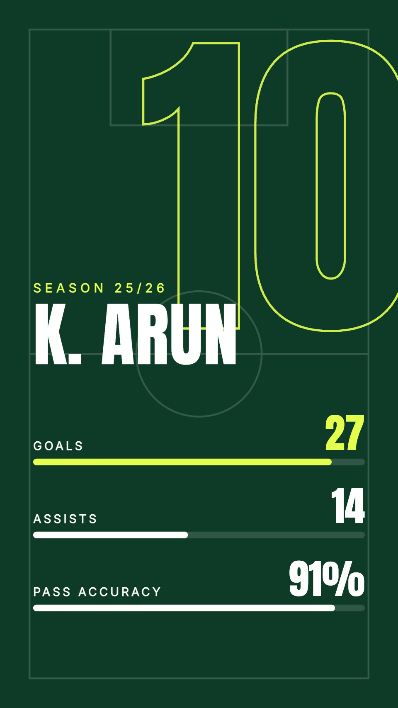

# Player stats

A 9:16 player stats card on a pitch: a giant number, the name and three stats counting up with their bars.

1080×1920 at 60 fps, 4 seconds. One scene, ready to grow into a
longer video.

## What to change

- **The picture**: `src/elements/sport/index.tsx`. Its colours are constants at
  the top, its words, numbers and shapes are in the JSX, and its timing is in
  frames (60 a second) with `k()` (0 to 1 between two frames) and `sp()` (a
  spring) from `src/kit.ts`.
- **The length**: `durationInFrames` in `veymelo.config.json`; add screens in
  `src/Video.tsx`. It is drawn at its design size (1080×1920) and scaled
  to cover any frame you render.
- **The sound**: `SOUNDS` in `src/Video.tsx`: thud, rise (in `assets/sfx`), each on the frame its cause happens.
- **The type**: `src/fonts.ts`: Inter, Anton (open-licensed, in `assets/fonts`).

## What to keep

The stats counting up in order, each bar landing with its number.
